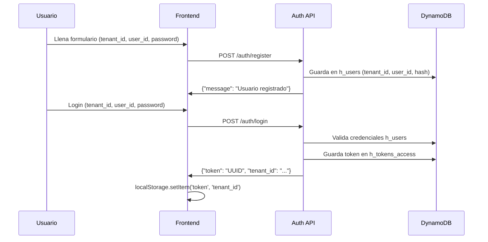
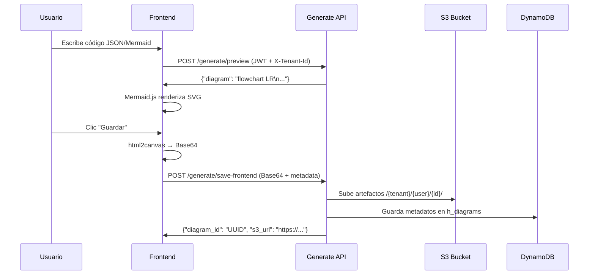
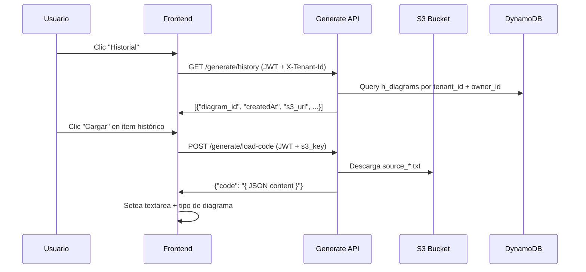

# Arquitectura de Solución CloudHackaton - Estado Actual

Este documento describe la arquitectura completa del sistema serverless multitenant para generación de diagramas técnicos.

---

## 1. Resumen de Componentes

| Capa        | Componente                      | Descripción                                                      |
| ----------- | ------------------------------- | ---------------------------------------------------------------- |
| Frontend    | React/Vite en S3                | Editor de código, login multitenant, preview con zoom, historial |
| CDN         | S3 Website Hosting              | Hospedaje estático directo sin CloudFront                        |
| API Gateway | AWS API Gateway                 | REST endpoints con CORS habilitado y validación JWT              |
| Lambdas     | Auth & Generate Services        | Funciones Python para auth, preview, save, history y load-code   |
| DynamoDB    | Tablas multitenant              | `h_users`, `h_tokens_access`, `h_diagrams`                       |
| S3          | Bucket `diagramas-hackacloud-*` | Almacena código fuente y artefactos organizados por tenant/user  |

---

## 2. Servicios y Endpoints

### 2.1 Auth Service

**Base URL**: `https://rzcwcayj10.execute-api.us-east-1.amazonaws.com/dev`

| Endpoint         | Método | Descripción                                 |
| ---------------- | ------ | ------------------------------------------- |
| `/auth/register` | POST   | Registro multitenant con tenant_id, user_id |
| `/auth/login`    | POST   | Login con generación de token UUID          |
| `/auth/validate` | POST   | Validación de token con claims de tenant    |

### 2.2 Generate Service

**Base URL**: `https://wmf60tekf9.execute-api.us-east-1.amazonaws.com/dev`

| Endpoint                  | Método | Descripción                                     |
| ------------------------- | ------ | ----------------------------------------------- |
| `/generate/preview`       | POST   | Genera código Mermaid desde JSON, sin persistir |
| `/generate/save-frontend` | POST   | Guarda diagrama desde Base64 del cliente        |
| `/generate/history`       | GET    | Lista historial de diagramas por tenant/usuario |
| `/generate/load-code`     | POST   | Carga código fuente desde S3 (evita CORS)       |

---

## 3. Tablas DynamoDB

### 3.1 h_users

```
PK: tenant_id (String)
SK: user_id (String)
Atributos:
  - hash_password (String - SHA256)
  - createdAt (ISO String)
```

### 3.2 h_tokens_access

```
PK: token (String - UUID)
Atributos:
  - tenant_id (String)
  - user_id (String)
  - expires (ISO String)
```

### 3.3 h_diagrams

```
PK: tenant_id (String)
SK: diagram_id (String - UUID)
Atributos:
  - owner_id (String)
  - diagram_type (String: flowchart|sequenceDiagram|classDiagram|stateDiagram)
  - s3_url (String - URL pública del artefacto)
  - source_code_s3key (String - clave S3 del código fuente)
  - createdAt (ISO String)
  - code_snippet (String - preview del código)
```

---

## 4. Almacenamiento S3

### 4.1 Bucket de Diagramas

**Nombre**: `diagramas-hackacloud-${stage}`  
**Estructura**:

```
{tenant_id}/{owner_id}/{diagram_id}/
    ├─ source_YYYYMMDDTHHMMSS.txt    # Código JSON/Mermaid original
    ├─ diagram_YYYYMMDDTHHMMSS.svg   # Imagen SVG generada
    ├─ diagram_YYYYMMDDTHHMMSS.png   # Imagen PNG (opcional)
    └─ diagram_YYYYMMDDTHHMMSS.pdf   # PDF exportado (opcional)
```

### 4.2 Bucket de Frontend

**Nombre**: `asr-hackaton`  
**Configuración**: Website hosting con `index.html` y política pública de lectura

---

## 5. Frontend - Características Implementadas

### 5.1 Autenticación Multitenant

- Formularios de registro/login con campo `tenant_id`
- JWT storage en localStorage con `token` + `tenant_id`
- Validación automática de sesión al cargar la app

### 5.2 Editor de Código (Bat-Editor)

- Textarea estilizada con fuente monospace (Fira Code, JetBrains Mono)
- Selector de tipo/subtipo de diagrama
- Botones de "Pegar Ejemplo" y "Cargar Ejemplo"
- Validación JSON previa al envío
- Gradiente de fondo y efectos visuales del tema Batman

### 5.3 Visualizador con Navegación

- **Zoom y Pan**: Implementado con `react-zoom-pan-pinch`
- **Controles**: Zoom in/out, reset, centrar
- **Interacción**: Rueda del mouse, arrastre, doble clic
- **Límites**: 0.1x a 5x zoom
- **Tamaño**: Contenedor de 800px altura para diagramas complejos

### 5.4 Generación de Diagramas

- **Preview en tiempo real**: POST `/generate/preview` → renderizado Mermaid.js
- **Formatos soportados**: JSON → Mermaid (flowchart, sequence, class, state)
- **Exportación**: SVG directo, PNG via html2canvas, PDF con jsPDF
- **Guardado**: Base64 → S3 con metadatos en DynamoDB

### 5.5 Historial Multitenant

- **Lista paginada**: Diagramas por tenant/usuario ordenados por fecha
- **Vista de tabla**: Fecha, tipo, botones de acción
- **Cargar código**: Descarga desde S3 via endpoint `/load-code`
- **Vista rápida**: Modal con imagen del diagrama guardado

---

## 6. Flujo de Interacción Completo

### 6.1 Registro y Autenticación



### 6.2 Generación y Guardado



### 6.3 Historial y Carga



---

## 7. Seguridad y Multitenancy

### 7.1 Aislamiento por Tenant

- **Tablas**: PK siempre incluye `tenant_id`
- **Tokens**: Incluyen `tenant_id` y `user_id` en claims
- **S3**: Prefijos por `/{tenant_id}/{user_id}/`
- **Validación**: Header `X-Tenant-Id` debe coincidir con JWT

### 7.2 Autenticación

- **JWT Simple**: Tokens UUID con expiración en DynamoDB
- **Headers requeridos**: `Authorization: Bearer <token>` + `X-Tenant-Id`
- **Validación automática**: Middleware en cada Lambda protegida

### 7.3 CORS

- **Origen**: `*` (configurado para desarrollo)
- **Headers permitidos**: `Content-Type`, `Authorization`, `X-Tenant-Id`
- **Métodos**: GET, POST, OPTIONS

---

## 8. Tecnologías y Dependencias

### 8.1 Frontend

- **Framework**: React 18 + Vite
- **Diagrams**: Mermaid.js para renderizado
- **Zoom/Pan**: react-zoom-pan-pinch
- **Export**: html2canvas (PNG), jsPDF (PDF)
- **Styling**: CSS personalizado con variables de tema

### 8.2 Backend

- **Runtime**: Python 3.13
- **Framework**: Serverless Framework v4
- **AWS Services**: Lambda, API Gateway, DynamoDB, S3
- **Libraries**: boto3, hashlib, uuid, json

### 8.3 Infrastructure as Code

- **Serverless.yml**: Definición de recursos AWS
- **Deployment**: `sls deploy` por servicio (auth, generate)
- **Environments**: Variables por stage (dev, prod)

---
